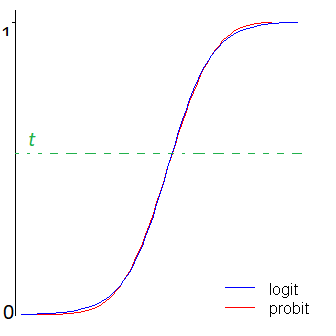

```{r setup, include=FALSE}
knitr::opts_chunk$set(echo = TRUE)
```
# Logit and Probit: What are they?

Both logit and probit models provide statistical models that **give the probability that a dependent response variable would be 0 or 1.** Usually, there is a threshold. If the value is above the threshold, then we predict that the outcome is a 1. if the value is below the threshold, then we predict the outcome is a 0. They are very similar and often given practically idential results, but because they use different functions to calculate the probabilities, their results are sometimes slightly different.

## Similarities
Both can be used for modeling the **relationship between one or more numerical or categorical predictor variables and a categorical outcome.** Both have versions for binary, ordinal, or multinomial categorical outcomes. And each of these requires specific coding of the outcome. For example, in both logistic and probit models, a binary outcome must be coded as 0 or 1.

## Differences
The real difference is theoretical: they use different link functions (https://www.theanalysisfactor.com/the-difference-between-logistic-and-probit-regression/)

In generalized linear models, instead of using Y as the outcome, we use a function of the mean of Y. This is the link function. (the link function is found in the url above)
  A logistic regression uses a logit link function: $f(\mu_{Y}) = ln(\frac {P}{1-P})$
  And a probit regression uses an inverse normal link function: $f(\mu_{Y}) = \phi^{-1} (P)$  


Logit and probit differ in how they define f( ). (https://www.methodsconsultants.com/tutorial/what-is-the-difference-between-logit-and-probit-models/) 
  The logit model uses something called the cumulative distribution function of the **logistic distribution.** 
  The probit model uses something called the cumulative distribution function of the **standard normal distribution to define f().**
  

Visually, their curves look different. The logit model has slightly flatter tails; the probit curve approaches the axes more quickly than the logit curve.

```{r fig.width=1, fig.height=10,echo=FALSE}

```

## When are they commonly used?

As seen in the graphs, they are very similar and for the most part, people choose one or the other based on their preferences.

**Short version:**  
Logit models, also known as logistic regression, are more popular in health sciences like epidemiology partly because coefficients can be interpreted in terms of odds ratios. 

Probit models can be generalized to account for non-constant error variances in more advanced econometric settings (known as heteroskedastic probit models) and hence are used in some contexts by economists and political scientists. 

**Long version (read at your own risk):**  

If these more advanced applications are not of relevance, than it does not matter which method you choose to go with.

Probit models do not suffer from IIA (Independence of Irrelevant alternatives) assumptions, and the logit model does.

  Independence of Irrelevant alternatives = In individual choice theory, IIA sometimes refers to Chernoff's condition or Sen's property α (alpha): if an alternative x is chosen from a set T, and x is also an element of a subset S of T, then x must be chosen from S.[2] That is, eliminating some of the unchosen alternatives shouldn't affect the selection of x as the best option.
  
  In other words, preferences for A or B should not be changed by the inclusion of X, i.e., X is irrelevant to the choice between A and B.
  
  One of the most well-known difference between logit and probit is the (theoretical) regression residuals distribution: normal for probit, logistic for logit (please see: Koop G. An Introduction to Econometrics Chichester, Wiley: 2008: 280).


Logit is definitely better in the case of "extreme independent variables". These are independent variables where one particularly large or small value will overwhelmingly often determine whether the dependent variable is a 0 or a 1, overriding the effects of most other variables. Hahn and Soyer formally define it thus (p. 4):

An extreme independent variable level involves the confluence of three events. 

  First, an extreme independent variable level occurs at the upper or lower extreme of an independent variable. For example, say the independent variable x were to take on the values 1, 2, and 3.2. The extreme independent variable level would involve the values at x = 3.2 (or x = 1). 
  Second, a substantial proportion (e.g., 60%) of the total n must be at this level. 
  Third, the probability of success at this level should itself be extreme (e.g., greater than 99%).

Probit is better in the case of "random effects models" with moderate or large sample sizes (it is equal to logit for small sample sizes). 

For fixed effects models, probit and logit are equally good. I don't really understand what Hahn and Soyer mean by "random effects models" in their article. Although many definitions are offered (as in this Stack Exchange question), the definition of the term is in fact ambiguous and inconsistent. But since logit is never superior to probit in this regard, the point is rendered moot by simply choosing probit.

Based on Hahn and Soyer's analysis, my conclusion is to always use probit models except in the case of extreme independent variables, in which case logit should be chosen.

# Demo using framingham

## Set up

**Install and Require the necessary packages.** This user-defined function allows you to run two lines of code and have it install and require the necessary packages without the prompt to restart your R session.
```{r packages, message=FALSE, warning=FALSE, results="hide"}
ipak <- function(pkg){
    new.pkg <- pkg[!(pkg %in% installed.packages()[, "Package"])]
    if (length(new.pkg)) 
        install.packages(new.pkg, dependencies = TRUE)
    sapply(pkg, require, character.only = TRUE)
}

packages <- c("caTools", "ROCR", "jpeg")
ipak(packages)
```

**Read in dataset - remember to setwd()**
```{r}
framingham = read.csv("framingham.csv")
```

**Look at structure**
```{r}
str(framingham)
```

**Table outcome:**  
Coded as **1** if at risk of coronary heart disease (CHD) within 10 years  
Coded as **0** if not at-risk
```{r}
table(framingham$TenYearCHD)
```

The outcome of a logistic regression model is a probability. Often, we want to make a binary prediction: is this person at risk?

We can do this using a threshold value, t  
  If P(at-risk = 1) >= t, predict at-risk
  If P(at-risk = 0) < t, predict not at-risk  

But what value for t? With no preference between the errors, select t = .5  
If t is large, predict at-risk rarely  
  More errors where we say not at-risk, but it is actually at-risk
  Detects patients who are at most risk
If t is small, predict  at-risk care often  
  More errors where we say at-risk, but it is actually not at-risk
  There are implications for the administering of drugs and treatments  

Load caTools package
```{r}
library(caTools)
```

Randomly split the data into training and testing sets
```{r}
set.seed(1000)
split = sample.split(framingham$TenYearCHD, SplitRatio = 0.65)
```

Split up the data using subset
```{r}
train = subset(framingham, split==TRUE)
test = subset(framingham, split==FALSE)
```

## Train Set
Logistic Regression Model
```{r}
framinghamLog = glm(TenYearCHD ~ ., data = train, family=binomial)
summary(framinghamLog)
```

Probit Regression Model. Recall, the difference between Logit and Probit is the link function, as demonstrated by the (link="probit") in the formula below.
```{r}
framinghamProbit = glm(TenYearCHD ~ ., data = train, family=binomial(link = "probit"))
summary(framinghamProbit)
```

What the model looks like

```{r fig.width=1, fig.height=5,echo=FALSE}
knitr::include_graphics("Liu.jpg")
```

## Test Set and its predictions

Predictions on the test set. The type="response" in the formula below gives us probabilities.
```{r}
predictTest = predict(framinghamLog, type="response", newdata=test)
```

Analyze predictions
```{r}
summary(predictTest)
plot(predictTest)
abline(h=.5, col="red", lwd=3, lty=2)
```

### Confusion Matrix  

"A **confusion matrix** is a table that is often used to describe the performance of a classification model (or "classifier") on a set of test data for which the true values are known." Essentially, it uses probabilities of True Negatives (TN), False Negatives (FN), False Positives (FP), and True Positives (TP).

```{r}
Confusion_matrix = matrix(c("","Actual Class = 0", "Actual Class = 1", "Predicted Class = 0", "True Negatives (TN)", "False Negatives (FN)", "Predicted Class = 1", "False Positives (FP)", "True Positives (TP)"), nrow = 3, ncol = 3)
Confusion_matrix
```

Overall Accuracy = (TN+TP)/N  
Sensitivity = TP/(TP+FN)
Specificity = TN/(TN+FP)

**A model with a higher threshold will have a lower sensitivity and a higher specificity**

Confusion matrix for threshold of 0.5. This is using a Logit model.
```{r}
table(test$TenYearCHD, predictTest > 0.5)
```

Sensitivity
```{r}
11/(187+11)
```

Specificity
```{r}
1069/(1069+6)
```

Overall accuracy
```{r}
(1069+11)/(1069+6+187+11)
```


Now trying that with probit
```{r}
predictTestProbit = predict(framinghamProbit, type="response", newdata=test)
table(test$TenYearCHD, predictTestProbit > 0.5)
```

Playing around with the threshold. Let's use a higher threshold.

(Back to logit) Confusion matrix for threshold of 0.7
```{r}
table(test$TenYearCHD, predictTest > 0.7)
plot(predictTest)
abline(h=.7, col="red", lwd=3, lty=2)
```

Sensitivity
```{r}
0/(198+0)
```

Specificity
```{r}
1074/(1074+1)
```

Overall accuracy
```{r}
(1074+0)/(1074+1+198+0)
```

Playing around with the threshold. Let's use a lower threshold.

Confusion matrix for threshold of 0.2
```{r}
table(test$TenYearCHD, predictTest > 0.2)
plot(predictTest)
abline(h=.2, col="red", lwd=3, lty=2)
```

Sensitivity
```{r}
110/(110+88)
```

Specificity
```{r}
865/(865+210)
```

Overall accuracy
```{r}
(865+110)/(865+210+88+110)
```

### Receiver Operator Curves

load ROCR package
```{r}
library(ROCR)
```

Prediction function
```{r}
ROCRpred = prediction(predictTest, test$TenYearCHD)
```

Performance function
```{r}
ROCRperf = performance(ROCRpred, "tpr", "fpr")
```

Plot ROC curve (Receiver Operator Curve)

Each point on the ROC curve represents a sensitivity/specificity pair corresponding to a particular decision threshold.  

True positive rate (sensitivity) on y-axis (proportion of poor care caught
False positive rate (1-specificity) on x-axis (proportion of good care labeled as poor care
```{r}
plot(ROCRperf)
plot(ROCRperf, colorize=TRUE)
plot(ROCRperf, colorize=TRUE, print.cutoffs.at=seq(0,1,by=0.1), text.adj=c(-0.2,1.7))
```

AUC: determine how accurate the model is using the area under the curve. You can use this to choose the threshold.

Given a random positive and negative, proportion of the time you guess which is which correctly. AUC of 1 is perfect, AUC of .5 is just a random coin flip
```{r}
as.numeric(performance(ROCRpred, "auc")@y.values)
```
